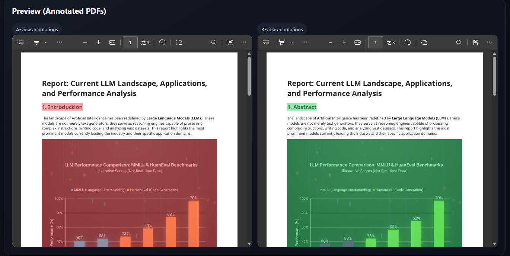

# 📘 PDF Comparison (Local)

Offline, reproducible PDF comparison: extract paragraphs/images/tables → match → diff → annotate PDFs → export reports. Local Web UI lets users upload two files, track progress, preview originals and annotated PDFs side-by-side, see a change list with page/bbox hints, and download all artifacts. No LLM features included.



## ✨ Key Features
- Content extraction: text, images, tables with bbox, page, UID; images with pHash.
- Matching & diffing: text via difflib with adjustable similarity threshold; images via pHash Hamming distance; tables by structure/content.
- Annotations: B-view highlights additions/edits; A-view highlights deletions/edits. Color rules (50% opacity): Added = soft green (0.2, 0.8, 0.4), Deleted = soft red (0.95, 0.3, 0.3), Modified = soft blue (0.25, 0.55, 0.9).
- Reports: full diff JSON, Markdown summary, extracted content JSON.
- Local Web UI: upload two PDFs, show progress, preview originals and annotated PDFs (A/B), change list with jump-to page/bbox, download all outputs.
- Threshold controls: text similarity uses difflib ratio (0–1, higher = stricter); image threshold is pHash Hamming distance (smaller = more similar).

## 🚀 Quick Start (Docker Compose)
All services (API + frontend UI + existing CLI flow) start with one command.
```bash
docker compose build
docker compose up   # boots API and UI, mounts repo to /app/pdf_compare_dev
```
Outputs remain on host `output/`. Default ports:
- API: http://localhost:8000
- UI: http://localhost:5173

### CLI (headless)
```bash
python main.py [pdf_a] [pdf_b] [output_dir]
# defaults: ./data/fileA.pdf ./data/fileB.pdf ./output
```

## 📂 Outputs (output/)
- `1_extracted_content_a.json` / `1_extracted_content_b.json`: extracted text/table/image info.
- `2_matched_data.json`: matching results.
- `3_diff_results.json`: diff list.
- `{fileB_stem}_annotated_b.pdf`: annotated B-view (adds/mods).
- `{fileA_stem}_annotated_a.pdf`: annotated A-view (deletes/mods).
- `summary_report.md`: summary (no LLM).
- `detailed_report.json`: full diff details.

## 🔧 Pipeline
1. Extract (`utils/pdf_utils.py`)
2. Match (`utils/matcher.py`)
3. Diff (`utils/differ.py`)
4. Annotate (`utils/annotator.py`)
5. Export (`utils/exporter.py`)

## 📁 Project Structure
```
pdf_compare_dev/
├── main.py               # CLI entry (delegates to pipeline.py)
├── pipeline.py           # pipeline orchestration (extract → match → diff → annotate → export)
├── api_server.py         # FastAPI service: /compare, /status/{id}, /result/{id}, /files/{id}/...
├── docker-compose.yml    # spins up API (uvicorn) + UI (Vite dev server)
├── Dockerfile            # API/pipeline image
├── requirements.txt      # Python deps
├── data/                 # sample/input PDFs
├── output/               # job outputs (annotated PDFs, JSON, reports) - ignored in git
├── frontend/             # React/Vite UI
│   ├── src/App.tsx       # UI logic (upload, progress, preview, downloads)
│   ├── src/api.ts        # API client
│   └── ...               # Vite configs, styles, types
└── utils/                # pipeline modules
    ├── pdf_utils.py      # extract text/images/tables
    ├── matcher.py        # match elements with thresholds
    ├── differ.py         # compute diffs
    ├── annotator.py      # annotate PDFs with color palette
    └── exporter.py       # write reports
```

## 🌐 API (FastAPI)
- `POST /compare` — multipart upload `file_a`, `file_b`; optional `text_threshold` (float, default 0.8), `image_threshold` (int, default 5). Returns `{job_id, state}`.
- `GET /status/{job_id}` — `{job_id, state, progress[], error?}`.
- `GET /result/{job_id}` — when done, returns originals (name/size/pages/download_url) and outputs (`annotated_a_pdf`, `annotated_b_pdf`, `extracted_a_json`, `extracted_b_json`, `matched_json`, `diff_json`, `summary_md`, `detailed_json`).
- `GET /files/{job_id}/{filename}` — serve files for download/preview.

## 🖥️ UI Behaviors
- Drag-and-drop or click to upload two PDFs, set thresholds, run comparison.
- Progress polling via `/status/{job_id}`.
- Inline preview of annotated PDFs (A- and B-view).
- Change list with color tags matching annotation palette; entries include page hints.
- Direct downloads for originals, annotated PDFs, and reports (`download` attribute).

## 🎨 Annotation Palette
- Added (B-view): soft green (0.2, 0.8, 0.4), opacity 0.5
- Deleted (A-view): soft red (0.95, 0.3, 0.3), opacity 0.5
- Modified (A/B): soft blue (0.25, 0.55, 0.9), opacity 0.5

## ⚙️ Threshold Notes
- Text similarity: difflib ratio in [0,1]. Higher threshold = stricter matching; lower = more permissive.
- Image similarity: pHash Hamming distance (integer). Lower distance = more similar; increase threshold to accept looser matches.

## 🤝 Contributing
- Use TDD: add/update tests around pipeline, API, and UI flows before changing behavior.
- Keep CLI flow (`python main.py`) working alongside API/UI.
- Prefer Docker Compose for local runs; outputs stay in `output/`.
